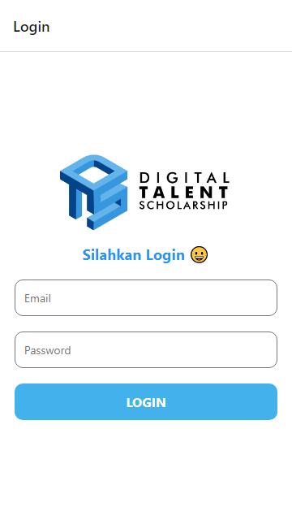
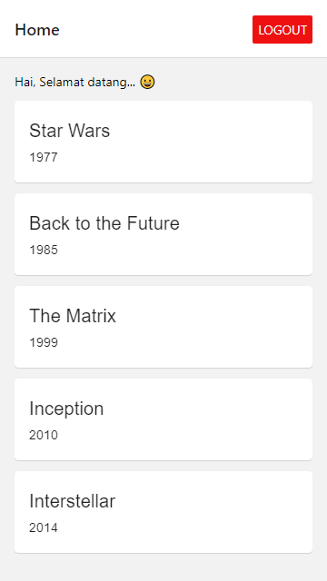

# Pendalaman React Native

## Daftar branch untuk masing-masing Lab/Tugas

1. [Lab 1. State Tanpa Redux](https://github.com/Abdurraziq/pendalaman-react/tree/Lab-1)
2. [Lab 2. Redux](https://github.com/Abdurraziq/pendalaman-react/tree/Lab-2)
3. [Lab 3. TextInput](https://github.com/Abdurraziq/pendalaman-react/tree/Lab-3)
4. [Tugas 1. Redux](https://github.com/Abdurraziq/pendalaman-react/tree/Tugas-1)
5. [Lab 4. HTTP Request](https://github.com/Abdurraziq/pendalaman-react/tree/Lab-4)
6. [Lab 5. User Authentication](https://github.com/Abdurraziq/pendalaman-react/tree/Lab-5)
7. [Tugas 2](https://github.com/Abdurraziq/pendalaman-react/tree/Tugas-2)

## Tugas 1. Redux

Mengimplementasikan ulang Lab 3 dengan menggunakan Redux.

